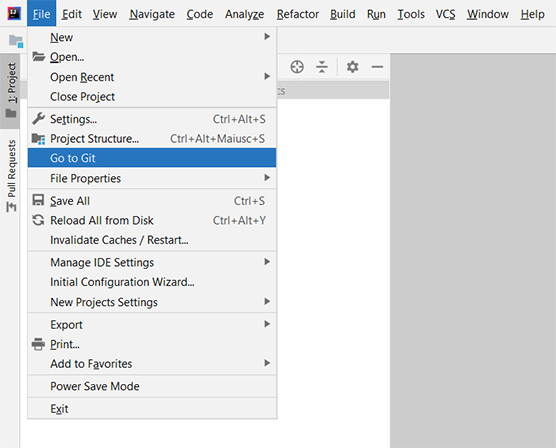

#  Go to Git Plugin

## Description

<!-- Plugin description -->
**Action to open the Git repository url in your default browser.**

This IntelliJ plugin adds an entry in the file main settings group.

Have a look at and contribute to the GitHub [repo](https://github.com/mirkoalicastro/go-to-git-plugin).
<!-- Plugin description end -->

## Installation

- Using IDE built-in plugin system:
  
  <kbd>Settings/Preferences</kbd> > <kbd>Plugins</kbd> > <kbd>Marketplace</kbd> > <kbd>Search for "Go to Git"</kbd> >
  <kbd>Install Plugin</kbd>
  
- Manually:
  
  Download the latest release and install it manually using
  <kbd>Settings/Preferences</kbd> > <kbd>Plugins</kbd> > <kbd>⚙️</kbd> > <kbd>Install plugin from disk...</kbd>

## External resources

[Here]() the link to the plugin homepage.

## Icons attribution:

[Git Logo](https://git-scm.com/downloads/logos) by [Jason Long](https://twitter.com/jasonlong) is licensed under the [Creative Commons Attribution 3.0 Unported License](https://creativecommons.org/licenses/by/3.0/)
